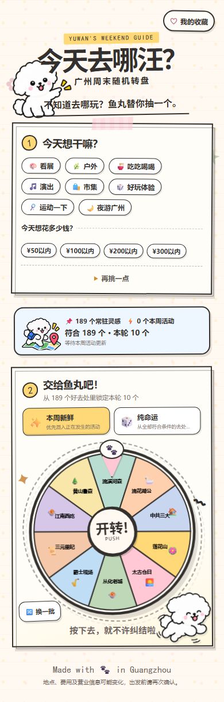
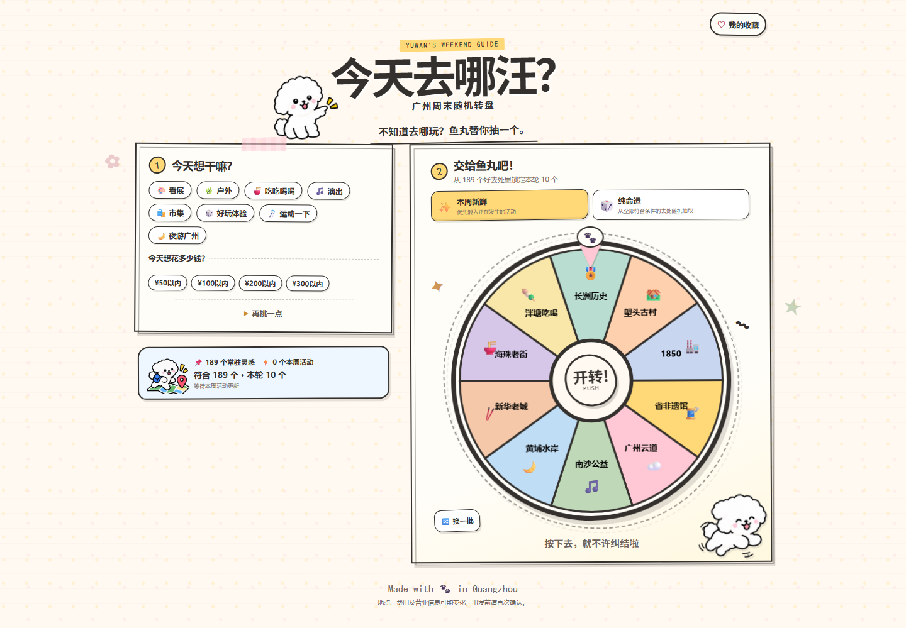

# 今天去哪汪？V2

「今天去哪汪？」是一个由鱼丸陪你做决定的广州周末随机 Web App。它把 189 个长期有效的广州去处与近期官方活动合并成活动池，支持完整筛选、两种随机模式和固定 10 候选转盘；结果票根同时给出参考费用、交通、地图入口与动态活动的官方来源。

线上地址：<https://xiangyu2141480.github.io/guangzhou-weekend-wheel/>





## V2 功能

- 8 类活动：看展、户外、吃喝、演出、市集、体验、运动、夜游。
- 预算、区域、时长、室内外，以及约会、独处、朋友、休息、运动、拍照、吃喝、知识、夜间、免费等状态筛选。
- `✨ 本周新鲜`：在符合条件时优先混入最多 4 个有效实时活动。
- `🎲 纯命运`：从全部符合条件的活动中等规则随机抽取。
- 每轮固定展示最多 10 个候选；支持单独「换一批」，不会因此直接生成结果。
- 最近候选和最近结果去重；池较小时逐级放宽，避免无结果死锁。
- 票根展示地点、场馆、费用、时长、环境、公共交通、地图和出发提醒；动态活动另有日期、官方来源和状态贴纸。
- 收藏保存在浏览器本地。V2 已彻底移除分享、复制和下载结果功能。
- 移动端优先，并提供 1440px 双栏桌面布局、键盘焦点与减少动态效果支持。

## 鱼丸角色资产

V2 的鱼丸角色来自项目维护者在本次任务中提供的 5 张透明 PNG 参考图。构建过程没有把整张参考图塞进页面，也没有重新设计另一只狗；而是从指定姿势中拆分、清理背景与低透明阴影、统一透明画布，产出 12 个独立的 512×512 PNG 状态资产：

- 核心：`idle`、`think`、`happy`、`point`、`rest`
- 场景：`search`、`run`、`spin`、`empty`、`favorite`、`map`、`ticket`

网页只通过 `YuwanMascot` 的中央映射读取角色资产。处理脚本位于 `scripts/process-yuwan-assets.ps1`，资产说明位于 `src/assets/yuwan/README.md`；原始参考图不随仓库发布。

代码按仓库许可证使用。鱼丸角色图形及用户提供的参考图不自动纳入代码许可证，后续复用或再发布需由使用者自行确认相应授权。地点名称、交通信息与 emoji 仅用于信息说明。

## 数据组成

### Evergreen 常驻池

`src/data/evergreen/` 按 8 个类别维护 189 条广州活动。每条记录包含：

- 区域和具体场馆/搜索关键词
- 参考预算与价格状态
- 预计时长和时间标签
- 室内外属性、适用状态标签
- 公共交通、推荐理由与出发提醒
- 可追溯的核对来源

维护常驻数据时请同步核对费用、开放状态、公共交通和场馆名称，并运行全量测试。

### Live 近期活动

部署工作流实际接入 3 个广州官方来源适配器：

1. [广州图书馆活动预告](https://www.gzlib.org.cn/hdActForecast/index.jhtml)
2. [广州市会展业公共服务平台展会信息](https://www.mice-gz.org/hz/a/48/index.html?p=true)
3. [广州市文化广电旅游局营业性演出许可公示](https://wglj.gz.gov.cn/gkmlpt/content/10/10968/post_10968082.html)

数据链路为：

```text
官方来源 → GitHub Actions → normalize → validate → dedupe → expire → deploy
```

`.github/workflows/deploy.yml` 约每 6 小时运行一次，也会在推送 `main` 时运行。同步器设置请求超时和一次重试；单个来源失败不会丢弃其他成功来源。若全部来源失败或新结果无效，会优先保留最近一次可发布快照；前端获取、解析或校验失败时则无提示中断地退回 189 条常驻活动。

Live 数据是准实时快照，不是实时票务库存。日期、场次、票价、预约和交通都可能变化，出发前必须以结果票根中的官方来源为准。

适配器及固定测试样本位于：

```text
scripts/sync-activities/sources/
scripts/sync-activities/__fixtures__/
```

部署产物为：

```text
public/data/live-activities.json
public/data/sync-status.json
```

## 本地开发

需要 Node.js 24+：

```bash
npm install
npm run dev
```

常用命令：

```bash
npm run sync:activities  # 拉取、清洗并写入近期活动快照
npm run sync:check       # 校验同步流程，不覆盖发布快照
npm run test:run         # Vitest 单元与组件测试
npm run lint             # ESLint
npm run build            # TypeScript + Vite 生产构建
npm run qa:e2e           # Playwright Chromium 浏览器流程
```

如果当前网络无法下载 Playwright Chromium，可设置
`PLAYWRIGHT_CHROMIUM_EXECUTABLE_PATH` 指向本机 Chrome 后运行 `npm run qa:e2e`。

生产环境使用 `/guangzhou-weekend-wheel/` 作为 Vite base path。前端通过 `import.meta.env.BASE_URL` 读取 JSON，因此 GitHub Pages 子路径和本地开发路径使用同一套代码。

## 部署与维护

推送到 `main` 后，GitHub Actions 会依次同步活动、运行测试与构建，并部署到现有 GitHub Pages 地址。不要新建仓库或更换 Pages URL。

发布前最低检查：

```bash
npm run test:run
npm run lint
npm run build
npm run qa:e2e
```

建议同时核对 `public/data/sync-status.json` 的成功来源数、最终活动数和告警，并在 375、390、430 与 1440 像素视口确认无水平溢出。
