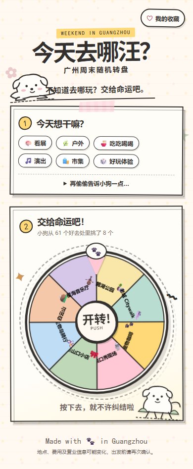

# 今天去哪汪？

一个用原创线稿小狗和真实 SVG 转盘，帮你决定广州周末去哪玩的轻量 Web App。



## Features

- 🎡 广州随机周末转盘
- 🎨 类型筛选
- 💰 预算筛选
- 🐶 可爱原创小狗
- ❤️ 本地收藏
- 📤 一键分享
- 📱 Mobile First
- 🚇 每个结果含参考费用和公共交通提示

## Development

需要 Node.js 24+：

```bash
npm install
npm run dev
```

质量检查：

```bash
npm run test:run
npm run lint
npm run build
```

## Deployment

推送到 `main` 后，`.github/workflows/deploy.yml` 会运行测试、构建 Vite 项目并自动部署 GitHub Pages。生产环境使用 `/guangzhou-weekend-wheel/` 作为 Vite base path。

## Data Maintenance

活动数据位于 `src/data/activities.ts`。更新地点时需同时核对参考费用、公共交通、开放状态和 `dynamic` 标识；演出与市集不写死具体日期，统一提醒用户出发前确认当周安排。

本版数据于 2026-08-27 整理，稳定公共文化设施参考了[广州市公共文化设施目录](https://www.gz.gov.cn/zwgk/zdly/lysc/cyzl/content/post_10280234.html)，户外地点参考了[广州公园景区公开信息](https://lyylj.gz.gov.cn/wzhc/hdyg/index.html)，并结合[广州市文化广电旅游局近期线路](https://wglj.gz.gov.cn/ggfw/lyl/content/post_10898332.html)复核。价格、预约和营业信息仍可能变化。

## License / Asset Notice

项目代码可按 MIT License 使用。

`src/assets/dogs/` 中的小狗 SVG 均为本项目原创极简线稿，与第三方 IP 素材分离。本项目没有使用「线条小狗」官方素材，也不暗示获得其官方授权。地点名称和 emoji 仅用于信息说明。
